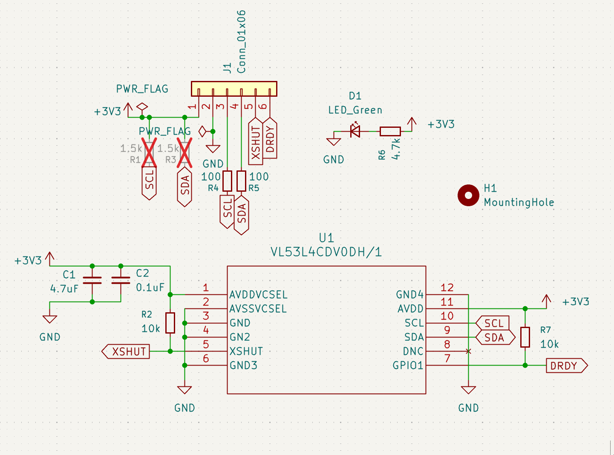
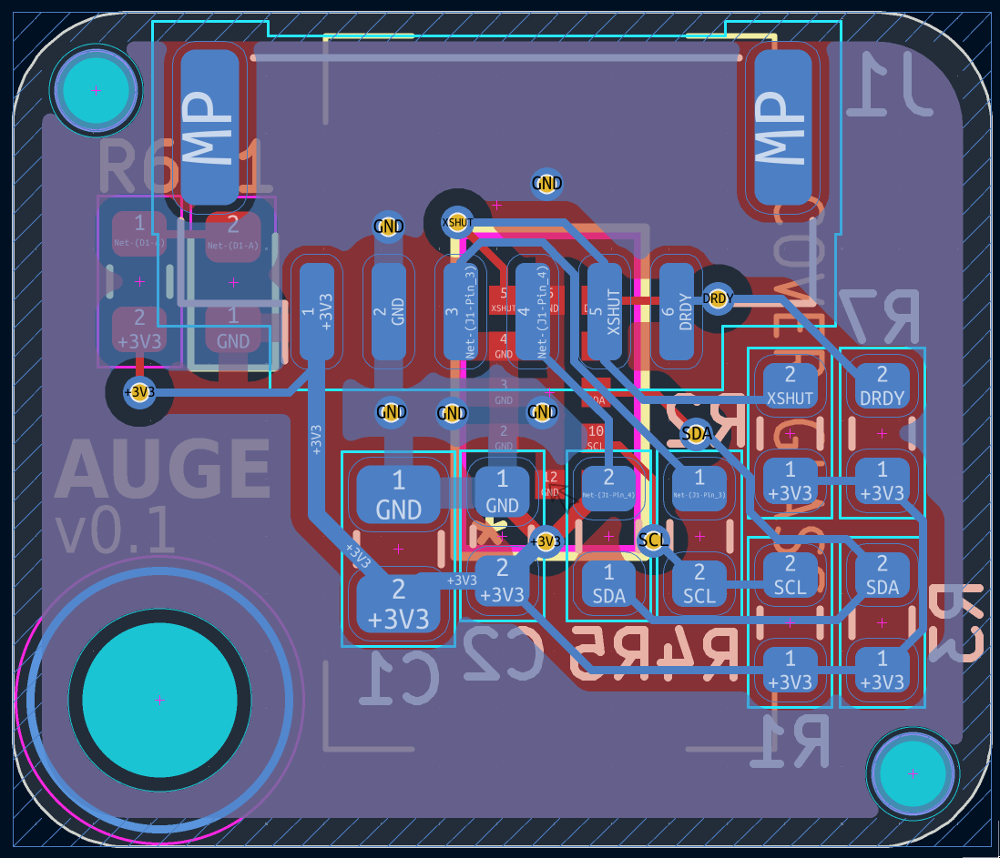
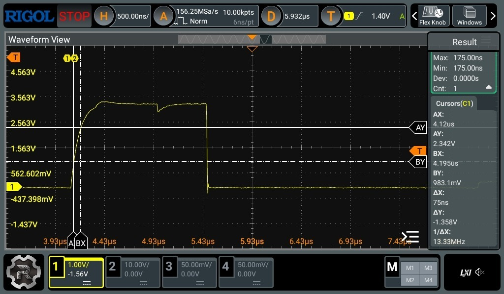
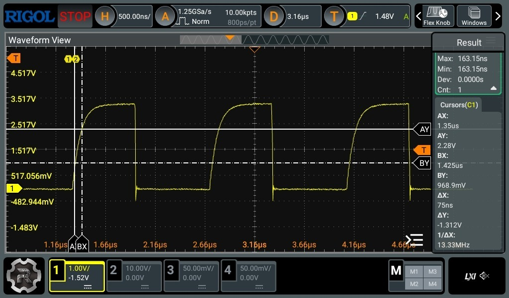

# Auge - Sumodd VL53LX Daughterboard

This repo contains the kicad PCB files, as well as libraries for footprints and symbols, for my
[VL53L4CD][https://www.st.com/en/imaging-and-photonics-solutions/vl53l4cd.html] daughterboard. It
is also compatible with VL53L0X. It is largely designed to work with my
[Sumodd motherboard](https://github.com/oddgrd/sumodd-hardware), but it could be used independently
with some [modification](#independent-use).

## Board stackup

The board is two layers, 1mm thick, with a standard 1oz copper on each side:

- Top layer with the sensor and power indicator LED, as well as a largely uninterrupted ground pour.
- Bottom layer with the sensor support components and a ground pour, as well as the JST-GH 6 pin
connector.

Two tooling holes were added to opposite corners to meet JLCPCB assembly requirements. The
schematic includes fields for LCSC part numbers, which are used in JLCPCB assembly.

## Components

All components are laid out as documented in the [VL53L4CD datasheet][VL53L4CD], section 1.4. All
SMD support components are 0603 imperial, except the 4.7uF cap, which is 0805. I could have gone
smaller, but want to be able to make changes easily, when experimenting with I2C pullups and series
resistors.

- VL53L4CD: modern ToF sensor, offering accurate measurements up to 1300mm at 100Hz.
- JST-GH 6 pin connector. 4 pins for I2C and power, one pin to enable changing I2C addresses for
multiple devices on the same bus, and GPIO1 pin for data ready interrupts.
- Pull-ups:
    - XSHUT and DRDY, 10k, as recommended in datasheet.
    - SCL and SDA, DNP in the schematic. The datasheet specifies that these should be placed once 
    per bus, and I will have at least three of these daughterboards connected to my motherboard.
    Therefore, I will place them once on the motherboard. The daughterboard has footprints for
    them, for flexibility, in case the sensor should be used with a different
    motherboard/independently. The datasheet documents that we should have 1.5k pull up resistors
    for 1MHz I2C, if the I2C bus capacitance is below 90 pF, which is the case with my very short
    motherboard traces and cables (confirmed in post-manufacturing [testing](#testing)).
- I2C series resistors, 100 ohms, which is recommended for 1MHz I2C with a <= 90 pF bus capacitance.
- Decoupling caps on [VL53L4CD][VL53L4CD] input, placed as close to the IC as possible, on the back
layer. 0.1uF closest, and 4.7 uF right next to it.
- Green LED that lights when power is connected.

The area around the sensor on the top side is left clear, to make room for a potential cover glass
in the future.

## Independent use

The Auge board is designed to work with my
[Sumodd motherboard](https://github.com/oddgrd/sumodd-hardware), so while it has I2C pullup
footprints, the resistors are DNP. If you want to use this board, you should either place pullups
on the Auge board itself if you are only using one, or on the I2C bus of the board you connect it
to if you are using several. Which resistors to use depends on your I2C bus capacitance, and which
I2C clock speed you aim for. For more information on that, see section
[1.4 in the VL53L4CD datasheet][VL53L4CD].

For reference, the Sumodd motherboard has low bus capacitance, so it places 1.5k pullups, along
with the default 100 ohm series resistors on the Auge board. If you have higher bus capacitance,
or if you don't want 1MHz I2C, you may want to change the series resistors too.

[VL53L4CD]: https://www.mouser.com/datasheet/2/389/vl53l4cd-2907214.pdf

## v01 Testing

The first version of the board has been manufactured, and I scoped it to ensure it is working as
expected. To achieve a 1MHz I2C speed at a bus capacitance of < 90 pF, I placed 100 ohm series
resistors on each board, and 1.5k pullups on SDA and SCL on the motherboard, as described above.

The goal with the resistor configuration is to get SDA and SCL rise and fall times of max 120ns
([table 5 in the VL53L4CD datasheet][VL53L4CD]), to avoid communication errors, for example if SDA
is supposed to be HIGH, but it hasn't risen past the receivers HIGH threshold by the time SCL crosses
the HIGH threshold, and so the receiver may interpret the bit incorrectly.

Note that we measure the delta from 30% of VDD (the I2C pull-up voltage, 3.3V on Sumodd) to 70%,
as this is the part that matters for digital logic. Anything over 70% will be considered HIGH,
it doesn't matter how long it takes to get all the way to 100%. For more information on that, see
section 3.1.2, as well as table 10 and 11 in the
[I2C spec](https://cache.nxp.com/docs/en/user-guide/UM10204.pdf).

### Result

We can see that the rise time for both SDA and SDL in this configuration is ~75ns, well within the
limits, and the fall time is much faster.

SDA rise time on Sumodd motherboard (see cursor on the right):

SCL rise time on Sumodd motherboard (see cursor on the right):

